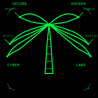
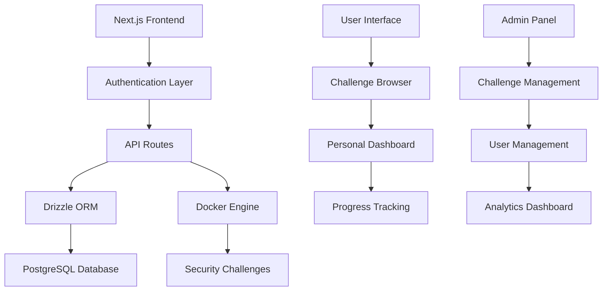

# TaSave - Cybersecurity Training Platform

<div align="center">



**A cutting-edge cybersecurity training platform powered by Docker containers**

[](https://nextjs.org/)
[](https://www.typescriptlang.org/)
[](https://tailwindcss.com/)
[](https://orm.drizzle.team/)
[](https://neon.tech/)

</div>

---

## Vision Statement

TaSave revolutionizes cybersecurity education by providing an immersive, hands-on learning environment where security professionals can practice, learn, and master various cybersecurity challenges in a safe, containerized ecosystem.

## Key Features

### Docker-Powered Challenges
- **Isolated Environments**: Each challenge runs in its own Docker container
- **Scalable Architecture**: Easily deployable and manageable infrastructure
- **Real-World Scenarios**: Authentic cybersecurity challenges and vulnerabilities

### Comprehensive Security Training
- **Web Application Security**: OWASP Top 10 vulnerabilities
- **Network Security**: Penetration testing and network analysis
- **Privilege Escalation**: Linux and Windows privilege escalation techniques
- **Forensics**: Digital forensics and incident response

### Community-Driven Learning
- **User Reviews**: Share experiences and insights with the community
- **Rating System**: Help others discover the best challenges
- **Progress Tracking**: Personal dashboards and achievement systems

### Advanced Features
- **Personal Lists**: Organize challenges with favorites and todo lists
- **Progress Analytics**: Track learning progress and skill development
- **Collaborative Learning**: Share solutions and methodologies
- **Machine Upload System**: Contributors can upload their own training machines
- **Role-Based Access Control**: Secure permission system for content management
- **Advanced Filtering**: Sort by newest, top-rated, most reviewed, and difficulty
- **Smart Badges**: Visual indicators for new, hot, and popular content

---

## Architecture Overview

<div align="center">



</div>

---

## Quick Start

### Prerequisites

- **Node.js** 18+ or **Bun** runtime
- **Docker** and **Docker Compose**
- **PostgreSQL** database (we recommend [Neon](https://neon.tech/))

### Installation

1. **Clone the repository**
   ```bash
   git clone https://github.com/iNeenah/TaSave.git
   cd TaSave
   ```

2. **Install dependencies**
   ```bash
   bun install
   # or
   npm install
   ```

3. **Environment setup**
   ```bash
   cp .env.example .env.local
   ```
   
   Configure your environment variables:
   ```env
   DATABASE_URL="your_postgresql_connection_string"
   NEXTAUTH_SECRET="your_secret_key"
   NEXTAUTH_URL="http://localhost:3000"
   ```

4. **Database setup**
   ```bash
   bun run db:migrate
   bun run db:seed
   ```

5. **Start development server**
   ```bash
   bun run dev
   ```

6. **Access the application**
   Open [http://localhost:3000](http://localhost:3000) in your browser

---

## Technology Stack

### Frontend
- **Framework**: Next.js 15.5.3 with App Router
- **Styling**: Tailwind CSS 4.0 with custom hacker theme
- **TypeScript**: Full type safety and developer experience
- **UI Components**: Custom component library with terminal aesthetics

### Backend
- **API**: Next.js API Routes with TypeScript
- **Database**: PostgreSQL with Neon cloud hosting
- **ORM**: Drizzle ORM for type-safe database operations
- **Authentication**: Custom JWT-based authentication system

### Infrastructure
- **Containerization**: Docker for challenge isolation
- **Deployment**: Vercel-ready with edge functions
- **Database Hosting**: Neon PostgreSQL cloud platform

---

## Project Structure

```
tasave/
├── 📂 src/
│   ├── 📂 app/                    # Next.js App Router pages
│   │   ├── 📂 dashboard/          # User dashboard
│   │   ├── 📂 machines/           # Challenge browser
│   │   ├── 📂 favorites/          # User favorites
│   │   └── 📂 todos/              # Todo management
│   ├── 📂 components/             # React components
│   │   ├── 📂 ui/                 # Reusable UI components
│   │   └── Navigation.tsx         # Main navigation
│   ├── 📂 lib/                    # Utility functions
│   │   ├── 📂 actions/            # Server actions
│   │   └── auth.ts                # Authentication logic
│   └── 📂 db/                     # Database configuration
├── 📂 assets/                     # Static assets and logos
├── 📂 drizzle/                    # Database migrations
├── 📄 drizzle.config.ts           # Drizzle ORM configuration
└── 📄 docker-compose.yml         # Docker services
```

---

## Design Philosophy

### Hacker Aesthetic
- **Color Scheme**: Matrix-inspired green on black terminal theme
- **Typography**: Monospace fonts for authentic terminal experience
- **Visual Effects**: Subtle glow effects and terminal-style animations
- **User Experience**: Intuitive navigation with cybersecurity-themed UI elements

### Accessibility
- **WCAG 2.1 AA Compliance**: Ensuring accessibility for all users
- **Keyboard Navigation**: Full keyboard support for power users
- **Screen Reader Support**: Semantic HTML and ARIA labels
- **High Contrast**: Terminal theme provides excellent readability

---

## Contributing

We welcome contributions from the cybersecurity community! Here's how you can help:

### Development Workflow

1. **Fork the repository**
2. **Create a feature branch**
   ```bash
   git checkout -b feature/amazing-feature
   ```
3. **Make your changes**
4. **Run tests and linting**
   ```bash
   bun run lint
   bun run type-check
   ```
5. **Commit your changes**
   ```bash
   git commit -m 'Add amazing feature'
   ```
6. **Push to your branch**
   ```bash
   git push origin feature/amazing-feature
   ```
7. **Open a Pull Request**

### Contribution Guidelines

- **Code Style**: Follow the existing TypeScript and React patterns
- **Testing**: Add tests for new features and bug fixes
- **Documentation**: Update documentation for API changes
- **Security**: Follow security best practices for all contributions

---

## Roadmap

### Phase 1: Foundation (Completed)
- [x] Core platform architecture
- [x] User authentication system
- [x] Basic challenge management
- [x] Docker integration

### Phase 2: Enhancement (Completed)
- [x] Machine upload system with role-based access control
- [x] Advanced filtering and sorting capabilities
- [x] Smart content discovery with badges and statistics
- [x] Enhanced dashboard with real-time metrics
- [ ] Real-time collaboration features
- [ ] Integrated terminal emulator
- [ ] Achievement system

### Phase 3: Scale (Planned)
- [ ] Multi-tenant architecture
- [ ] Enterprise features
- [ ] Advanced analytics
- [ ] Mobile application

---

## Partnerships

<div align="center">

### Proudly Supported By

<table>
<tr>
<td align="center">

<br>
<strong>Silicon Misiones</strong>
<br>
<em>Technology Innovation Hub</em>
</td>
<td align="center">

<br>
<strong>TaSave Platform</strong>
<br>
<em>Cybersecurity Training Excellence</em>
</td>
</tr>
</table>

</div>

---

## License

This project is licensed under the **MIT License** - see the [LICENSE](LICENSE) file for details.

---

## Links and Resources

- **Live Demo**: [https://tasave.vercel.app](https://tasave.vercel.app)
- **Documentation**: [https://docs.tasave.dev](https://docs.tasave.dev)
- **Bug Reports**: [GitHub Issues](https://github.com/iNeenah/TaSave/issues)
- **Community**: [Discord Server](https://discord.gg/tasave)
- **Contact**: [hello@tasave.dev](mailto:hello@tasave.dev)

---

<div align="center">

**Built by the cybersecurity community**

*Empowering the next generation of security professionals*

[](https://github.com/iNeenah/TaSave/stargazers)
[](https://github.com/iNeenah/TaSave/network/members)
[](https://github.com/iNeenah/TaSave/watchers)

</div>